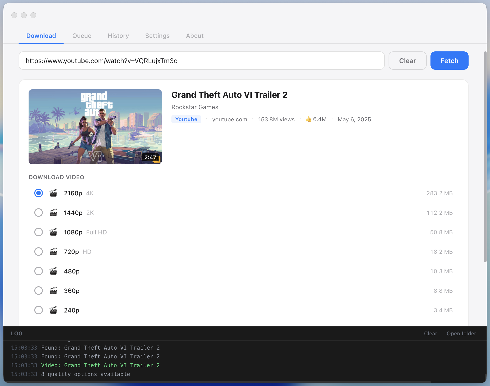
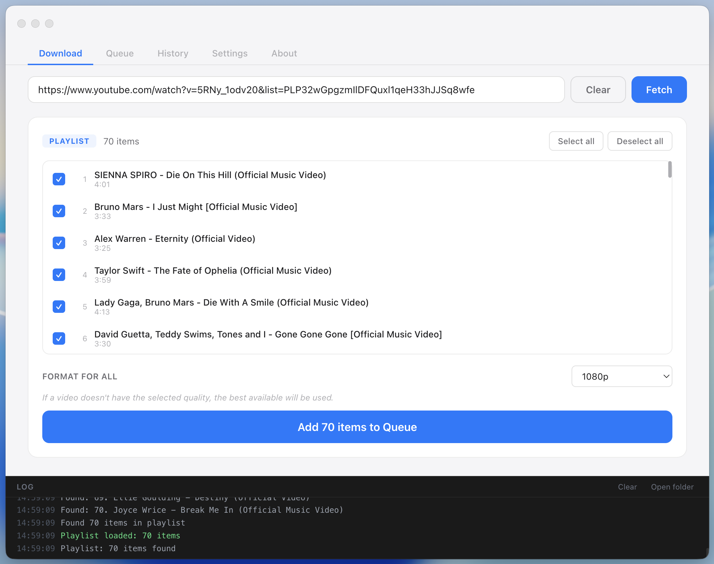

<div align="center">


# ArcDLP

Open-source desktop video downloader powered by [yt-dlp](https://github.com/yt-dlp/yt-dlp).
Paste a URL, pick a quality, download.

Supports YouTube, Vimeo, Twitter/X, SoundCloud, and [thousands of other sites](https://github.com/yt-dlp/yt-dlp/blob/master/supportedsites.md).

Everything runs locally on your machine - no cloud, no accounts, no tracking.

**[Download](https://github.com/archisvaze/arcdlp/releases/latest)**

</div>

<br/>

<p align="center">
  
  &nbsp;&nbsp;
  
</p>

## Download & Install

**[Download the latest release](https://github.com/archisvaze/arcdlp/releases/latest)**

Go to the Releases page, scroll down to **Assets**, and click the file for your system:

- **macOS**: `ArcDLP-x.x.x.dmg`
- **Windows**: Coming soon
- **Linux**: Coming soon

No dependencies to install. yt-dlp and ffmpeg are bundled inside the app.

### macOS

1. Download the `.dmg` file
2. Open it and drag ArcDLP to your Applications folder
3. Open ArcDLP

macOS will show a security warning the first time because the app is not code-signed yet. This is normal.

To fix it:

1. Click **Done**
2. Open **System Settings**
3. Go to **Privacy & Security**
4. Scroll down and click **Open Anyway** next to ArcDLP
5. Enter your password

You only need to do this once.

### Windows (coming soon)

Windows may show **"Windows protected your PC"** the first time. This is normal for new unsigned apps.

1. Run the installer
2. Click **More info**
3. Click **Run anyway**

### Linux (coming soon)

1. Download the `.AppImage` file
2. Right-click the file, go to Properties, Permissions, and check **Allow executing file as program** (or run `chmod +x ArcDLP-*.AppImage`)
3. Double-click to run

No installation needed, the AppImage runs directly.

## Features

- **Single video downloads** - Fetch video info, preview metadata, choose quality (4K/2K/1080p/720p/480p/360p/240p), and download as MP4 or extract audio as MP3
- **Playlist support** - Paste a playlist URL, select which items to download, pick a format, and queue them all at once
- **Download queue** - Sequential processing with per-item progress, retry, cancel, and skip. One failure never stops the rest
- **YouTube sign-in** - Access age-restricted, private, and members-only content through a built-in browser login window. Credentials go directly to Google
- **Download history** - Quick access to previously fetched videos with cached metadata
- **Multi-site compatibility** - Works with any site yt-dlp supports. Format detection adapts automatically to different streaming approaches across sites
- **Light and dark mode** - Follows your system preference. macOS vibrancy supported

## Usage

1. Paste a video or playlist URL and click **Fetch**
2. Pick a quality (or choose MP3 for audio extraction)
3. Click **Add to Queue**
4. Downloads are saved to `~/Downloads/ArcDLP` by default (changeable in Settings)

For playlists, you can select/deselect individual items and choose a format for the whole batch before queueing.

To access private or age-restricted YouTube videos, sign in via **Settings > YouTube Account**. Your credentials go directly to Google through their standard login page.

## Support the Project

If ArcDLP is useful to you, consider supporting development:

- [Sponsor on GitHub](https://github.com/sponsors/archisvaze)
- [Buy Me a Coffee](https://buymeacoffee.com/archisvaze)

---

## For Developers

Everything below is for people who want to build from source, modify the app, or contribute.

### Contributing

Contributions are welcome. The codebase is intentionally simple - no frameworks, no build tools, vanilla JS throughout.

Before making changes, read through the code and match existing patterns. A few principles the project follows:

- **Keep it simple.** If something can be done in 30 lines, don't use a library.
- **Resilience first.** One failure should never kill the queue. Users should always know what's happening.
- **Explicit actions only.** No auto-fetching, no auto-retrying. Every action traces to a button click.
- **Let yt-dlp do the work.** Don't reimplement what yt-dlp already handles. The app is a GUI wrapper, not a competing tool.
- **Multi-site compatibility.** Never assume YouTube-specific behavior unless explicitly scoped. Format detection, error handling, and UI labels should work for any site yt-dlp supports.

#### Getting Started

1. Fork and clone the repo
2. `npm install` (downloads yt-dlp + ffmpeg automatically) - See details below for Windows and Linux install
3. `npm run dev` to launch with DevTools - See more details below
4. Make your changes, test across a few different sites
5. Open a PR with a clear description of what changed and why

### Build from Source

```bash
git clone https://github.com/archisvaze/arcdlp.git
cd arcdlp
npm install
```

#### Cross-platform builds

To build for a different platform's ffmpeg binary:

```bash
# Windows (x64)
npm_config_platform=win32 npm_config_arch=x64 npm install

# Linux (x64)
npm_config_platform=linux npm_config_arch=x64 npm install
```

`npm install` automatically downloads the yt-dlp binary for your platform via the postinstall script. ffmpeg is bundled via `ffmpeg-static`.

### Development

```bash
npm run dev          # macOS / Linux
npm run dev:win      # Windows
```

This launches the app with DevTools enabled and verbose logging.

### Production Builds

```bash
npm run build:mac      # macOS - produces .dmg and .zip
npm run build:win      # Windows - produces NSIS installer
npm run build:linux    # Linux - produces AppImage
npm run build:all      # All platforms
```

Both yt-dlp and ffmpeg binaries are bundled into the built app via `extraResources` in package.json.

### Project Structure

```
arcdlp/
├── src/
│   ├── main/
│   │   ├── main.js          # Electron main process, IPC, window, history
│   │   ├── preload.js        # Context bridge (window.api)
│   │   ├── ytdlp.js          # yt-dlp integration: spawn, parse, download
│   │   ├── queue.js          # Sequential download queue with per-item state
│   │   ├── cookies.js        # YouTube cookie auth and Netscape format export
│   │   └── utils.js          # Dev mode flag, logging helpers
│   └── renderer/
│       ├── index.html        # UI structure
│       ├── renderer.js       # UI logic, state, rendering
│       └── index.css         # All styles
├── scripts/
│   ├── postinstall.js        # Downloads yt-dlp binary on npm install
│   └── fix-ffmpeg-win.js     # Renames ffmpeg for Windows builds
├── bin/                      # yt-dlp binary (auto-populated by postinstall)
├── build/                    # App icons (icon.icns, icon.ico, icon.png)
├── package.json
├── LICENSE
└── README.md
```

### How It Works

1. User pastes a URL and clicks Fetch
2. App spawns `yt-dlp --dump-json` to get video metadata and available formats
3. User picks a quality preset or audio extraction
4. Click "Add to Queue" - the download is queued and processed sequentially
5. yt-dlp handles the actual download with `--progress-template` for structured progress output
6. Completed files are saved to the configured download folder

For playlists, the app uses `--flat-playlist --dump-json` to stream items one at a time, then queues selected items for download.

### Dependencies

Only two runtime dependencies:

- **electron-store** - Persistent settings and history
- **ffmpeg-static** - Bundled ffmpeg binary for audio extraction and format merging

Dev dependencies: `electron`, `electron-builder`.

yt-dlp handles all downloading, format selection, and ffmpeg orchestration internally. The app is a GUI wrapper around it.

### Roadmap

ArcDLP covers the core download workflow, but yt-dlp has a huge feature set that could be surfaced in the GUI. Here's what's planned and where contributors can help.

#### Quality of Life

- **Thumbnails in playlist items** - The data is already fetched, just not rendered yet
- **File size estimates** - Show approximate size on quality presets when available
- **Download complete notification** - System notification when the queue finishes (only if window is not focused)
- **Playlist fetch cancellation** - Currently can't cancel a playlist fetch mid-way through
- **Verbose log toggle** - Clean messages by default, raw yt-dlp output when debugging

#### Advanced yt-dlp Features

yt-dlp supports a lot more than basic downloading. These features would make great contributions:

- **Subtitle downloads** - `--write-subs`, `--sub-langs`, language selection UI
- **Embed metadata** - `--embed-thumbnail`, `--embed-metadata` for tagging files
- **SponsorBlock integration** - `--sponsorblock-remove`, `--sponsorblock-mark` to skip or mark sponsored segments
- **Additional audio formats** - AAC, FLAC, WAV, Opus extraction (currently MP3 only)
- **Format filtering** - Expose yt-dlp's format selection syntax for advanced users
- **Download archive** - `--download-archive` to skip already-downloaded videos
- **Rate limiting** - `--limit-rate` for bandwidth control
- **Proxy support** - `--proxy` for users behind restrictive networks
- **Custom output templates** - `--output` template configuration in settings
- **Chapter splitting** - `--split-chapters` to save individual chapters as separate files

#### App-Level Features

- **Auto-update** - Check for new ArcDLP releases via GitHub Releases API
- **Keyboard shortcuts** - Quick access to common actions
- **Multi-site authentication** - Expand the cookie login flow beyond YouTube
- **Playlist detection for more sites** - Currently conservative (YouTube and SoundCloud only)
- **DOM virtualization for large playlists** - Currently renders all items, works fine under ~1000

#### Known Cleanup Items

- `video:fetch` IPC returns the full raw JSON (50-200KB) even in production - should be dev-only
- Queue `_items` array has no upper bound - consider a cap or auto-clear
- Playlist checkbox uses inline `onchange` handler - could use event delegation
- Log type detection is greedy (`msg.includes('complete')` matches "incomplete")

## License

[MIT](LICENSE)

## Credits

- [yt-dlp](https://github.com/yt-dlp/yt-dlp) - The engine that does all the heavy lifting
- [Electron](https://www.electronjs.org/) - Desktop app framework
- [ffmpeg](https://ffmpeg.org/) - Audio/video processing (bundled via ffmpeg-static)
